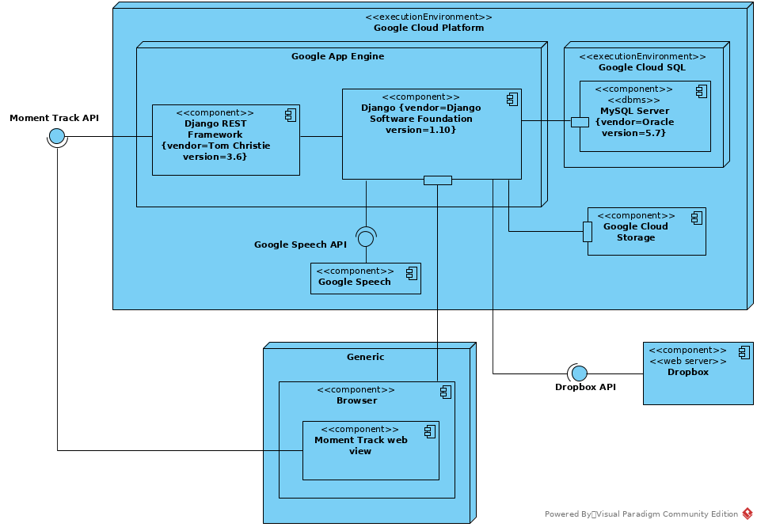

.. _architectural_design:

===============================
Progettazione dell'architettura
===============================

.. _architectural_decisions:

Decisioni architetturali
~~~~~~~~~~~~~~~~~~~~~~~~

.. _portability:

Portabilità
-----------

Per realizzare una soluzione che sia portabile su ogni tipo di piattaforma, sia
essa desktop che mobile, è stato deciso di:

    * utilizzare il linguaggio `Python`_ per l'implementazione del servizio
      lato server
    * utilizzare il linguaggio `Javascript`_ per l'implementazione di alcune
      funzionalità lato client
    * utilizzare il framework `Foundation`_ per l'implementazione di un
      front-end che fosse responsive per poter essere utilizzato anche su
      dispositivi mobili

.. _protection_from_changes:

Protezione dalle variazioni
---------------------------

Per ridurre al minimo il numero di modifiche da effettuare nel caso si
presentino delle variazioni da apportare al codice o alle specifiche di
progetto, si è scelto di utilizzare:

    * il framework `Django`_ in quanto permette l'interazione con qualunque
      :abbr:`DBMS (DataBase Management System)` in modo unico tramite il
      modello :abbr:`ORM (Object Relational Mapping)`
    * `Django REST Framework`_ per la generazione automatica di
      :abbr:`API (Application Programming Interface)` in diversi formati
      di output

.. _maintainability:

Manutenibilità
--------------

Data la natura commerciale dell'applicazione, è possibile che nel corso del
tempo nascano nuovi requisiti dovuti a:

    * nascita di nuovi concorrenti
    * cambiamento delle necessità del mercato
    * richieste di personalizzazione da parte dei clienti
    * …

Per far fronte a queste evenienze i sopracitati framework che si è scelto di
utilizzare permettono per loro natura di minimizzare tempo e sforzo necessari
nel caso si presentino modifiche da apportare.

Unitamente a questo, durante la scrittura del codice si utilizzeranno le più
consolidate tecniche di programmazione e *Design Pattern* allo scopo di:

    * eliminare codice duplicato
    * ridurre la complessità del codice
    * massimizzare il riuso di codice
    * …

.. _performance:

Performance
-----------

Al fine di garantire sempre le massime prestazioni del servizio ed offrire così
all'utente una migliore esperienza si è scelto di:

    * spostare lato client le operazioni più onerose come la conversione tra i
      formati audio e video
    * demandare la trascrizione del testo pronunciato al servizio esterno
      `Google Speech API`_ per avere meno carico sul server e risultati di
      migliore qualità

.. _Python: https://www.python.org
.. _Javascript: https://developer.mozilla.org/en-US/docs/Web/JavaScript
.. _Foundation: https://foundation.zurb.com
.. _Django: https://www.djangoproject.com
.. _Django REST Framework: https://www.django-rest-framework.org
.. _Google Speech API: https://cloud.google.com/speech

.. _deployment_diagram:

Diagramma di deployment
~~~~~~~~~~~~~~~~~~~~~~~

.. _use_case_diagram:

Diagramma dei casi d'uso
~~~~~~~~~~~~~~~~~~~~~~~~

.. todo::
    Aggiungere diagramma dei casi d'uso ed eventuali sottodiagrammi

.. _activity_diagram:

Diagramma di attività
~~~~~~~~~~~~~~~~~~~~~

.. todo::
    Aggiungere diagramma di attività o altro diagramma che mostri il
    workflow dell'applicazione

.. _data_diagram:

Diagramma dei dati
~~~~~~~~~~~~~~~~~~

.. todo::
    Aggiungere diagramma ER dei dati

