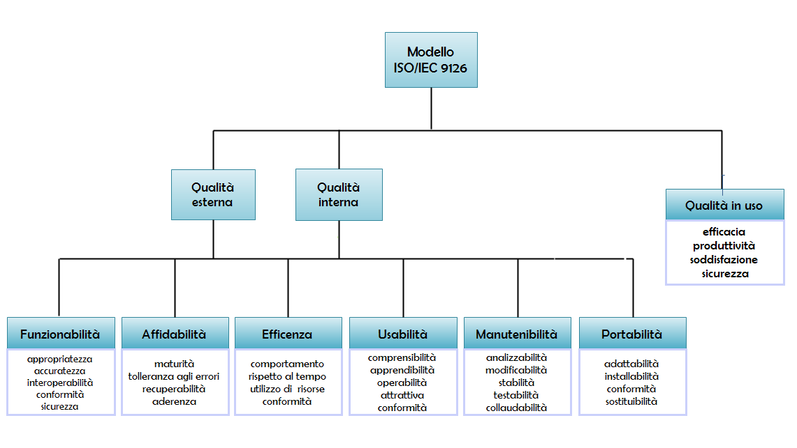

.. _introduction:

============
Introduzione
============

.. note::
    Il documento è rivolto a committente, referente, sviluppatori e tester
    perciò il livello tecnico del linguaggio utilizzato sarà variabile così
    da essere comprensibile al target cui si rivolge la specifica sezione.

Il progetto si articola in cinque fasi principali:

    #. studio di fattibilità
    #. analisi e specifica dei requisiti
    #. progettazione
    #. implementazione
    #. test

Durante tutte queste fasi si cercherà quanto più possibile di rispettare i
principi fondamentali dell'ingegneria del software e del
`Modello ISO/IEC 9126 <https://en.wikipedia.org/wiki/ISO/IEC_9126>`_.

    Modello ISO/IEC 9126

.. _product_purpose:

Scopo del prodotto
~~~~~~~~~~~~~~~~~~

Moment Track © si propone di permettere di fare ricerche testuali di
parole/frasi che sono state pronunciate in un file audio arbitrariamente lungo.
Come risultato della ricerca si otterrà il momento approssimativo in cui le
parole/frasi cercate sono state pronunciate.

.. _use_case:

Caso d'uso
----------

Un possibile scenario in cui un tale servizio si rivelerebbe fondamentale è
quello giornalistico. In tale scenario non è inusuale fare riprese video di
diverse ore (es. conferenze politiche) da cui dover estrarre solo pochi minuti
salienti da mostrare durante il telegiornale.

Allo stato attuale il cameraman, su indicazione del giornalista, si trova
costretto a dover riascoltare tutto o parte dell'audio registrato al fine di
trovare il momento in cui viene pronunciata una specifica frase per fare il
montaggio video richiesto.

Questa procedura richiede molto tempo al cameraman e quindi costa molto anche
all'azienda.

.. _feasibility_study:

Studio di fattibilità
~~~~~~~~~~~~~~~~~~~~~

Il servizio che si intende realizzare nasce con in mente un target ben
specifico (vedi :ref:`use_case`), ma non se ne limita l'utilizzo a utenti
differenti seppur con modalità diverse rispetto alle aziende cui è rivolto.

.. todo::
    * Aggiungi riferimento al paragrafo con i tipi di utente e le diverse
      modalità di accesso *(non appena disponibile)*.

Il sistema è fortemente basato su servizi esterni messi a disposizione da
terzi, quindi si occuperà principalmente della realizzazione della logica
applicativa che ne permette l'utilizzo per lo scopo specificato in
:ref:`product_purpose`.

Il sistema da implementare ha **costi** e **tempi** prevedibili in quanto non
rappresenta una vera e propria innovazione tecnologica, ma un valido utilizzo
di servizi già presenti sul mercato quali:

    * `Google Cloud Platform`_, per l'integrazione con i servizi offerti da
      Google
    * `Google Speech API`_, per l'estrazione del testo dalla sorgente audio
    * `Paypal Payments REST API`_, per il pagamento del servizio
    * `Dropbox API`_, per l'accesso e il download di file audio degli utenti

Inoltre verrà utilizzato un forte
approccio al riuso di codice già esistente secondo le possibilità imposte
dalle relative licenze d'uso; questo permetterà di mantenere bassi i tempi di
sviluppo. Il sistema potrà essere utilizzato installandolo in locale, previa
autorizzazione secondo licenza d'uso, oppure essere reso disponibile sul web
tramite servizi di hosting anche a pagamento (fare riferimento alla tabella
dei prezzi e delle limitazioni del servizio specifico scelto).
A prescindere dal tipo di hosting scelto, locale o remoto, gratuito o a
pagamento, un costo imprescindibile è quello per l'utilizzo delle `Google
Speech API`_.

Il team di sviluppo è originariamente composto da una sola persona

Quanto appena detto permette di stabilire la fattibilità del progetto secondo
i due fattori citati di costo e tempo che risultano di:

    * **costo**, dipendente dall'utilizzo (vedi `Google Speech API Pricing`_)
    * **tempo**, stimato di 30 giorni compresa la fase preliminare

.. _Google Cloud Platform: https://cloud.google.com/
.. _Google Speech API: https://cloud.google.com/speech/
.. _Google Speech API Pricing: https://cloud.google.com/speech/pricing/
.. _Paypal Payments REST API: https://developer.paypal.com/docs/api/payments/
.. _Dropbox API: https://www.dropbox.com/developers

