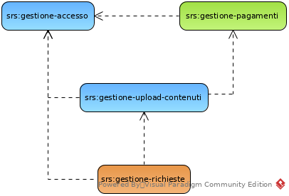

.. _requirements_analysis:

=====================
Analisi dei requisiti
=====================

A seguire l'analisi dettagliata dei requisiti utente. Si farà riferimento a tre
tipologie di utenti differenti:

    utente non registrato (ospite)
        si tratta di un utente con forti limitazioni nell'utilizzo del servizio.
        Può effettuare ricerche su file multimediali caricati con visibilità
        pubblica dagli altri utenti, ma non può caricarne di propri.
        L'accesso a questa funzionalità può avvenire tramite la pagina apposita
        o tramite le API pubbliche.

    utente registrato (privato)
        si tratta di un utente del sistema con pieno accesso alle funzionalità
        del servizio, ma con alcune limitazioni riguardo la scelta dei parametri
        di configurazione. Rispetto agli altri tipi di utenti, però, ha la
        possibilità di fare l'upload di file anche dal suo personale profilo
        `Dropbox`_.

    utente registrato (azienda)
        si tratta di un utente del sistema con pieno accesso alle funzionalità
        del servizio e alla configurazione dei parametri per la
        personalizzazione dell'esperienza utente. Rispetto agli altri tipi di
        utente, inoltre, ha la possibilità di sottoscrivere un abbonamento
        annuale creato secondo le proprie necessità. Un utente di questo tipo
        può creare e gestire account *dipendenti* nonché amministrare le loro
        richieste.

    utente registrato (dipendente aziendale)
        si tratta di un utente facente riferimento a un account aziendale.
        Deve essere abilitato dall'utente aziendale che può specificarne i
        permessi sui file caricati da lui o da altri account di dipendenti.
        I permessi riguardano la possibilità di *visualizzare*, *modificare* e
        *cancellare* le richieste fatte da altri, oppure *cancellare* le
        proprie.

.. _srs_access_management:

Gestione accesso
~~~~~~~~~~~~~~~~

+-----------------+-----------------------------------------------------------+
| **UID**         | srs:gestione-accesso                                      |
+-----------------+-----------------------------------------------------------+
| **Priorità**    | Normale                                                   |
+-----------------+-----------------------------------------------------------+
| **Dipendenze**  | *nessuna*                                                 |
+-----------------+-----------------------------------------------------------+
| **Descrizione** | Possibilità di registrare un utente privato o aziendale.  |
|                 | La registrazione richiede l'inserimento di alcuni dati    |
|                 | necessari e di altri a discrezione dell'utente.           |
|                 |                                                           |
|                 | Se l'utente è un privato la registrazione può avvenire in |
|                 | modo automatico ricavando i dati necessari da servizi     |
|                 | esterni dopo l'approvazione dell'utente stesso.           |
|                 |                                                           |
|                 | Un utente dipendente *non* può eseguire la registrazione, |
|                 | ma deve essere abilitato dall'account aziendale di        |
|                 | riferimento dell'azienda cui afferisce.                   |
|                 |                                                           |
|                 | A seconda del tipo di utente che si sta registrando i     |
|                 | dati necessari e quelli opzionali possono cambiare.       |
+-----------------+-----------------------------------------------------------+
| **Motivazione** | Permettere l'utilizzo di tutte le funzionalità che non    |
|                 | hanno visibilità pubblica.                                |
+-----------------+-----------------------------------------------------------+
| **Requisiti**   | * Visualizzazione e compilazione form di registrazione    |
| **funzionali**  | * Compilazione form di registrazione tramite social       |
|                 | * Login classico al servizio                              |
|                 | * Login al servizio tramite social                        |
+-----------------+-----------------------------------------------------------+
| **Requisiti**   | Per la registrazione come privati:                        |
| **informativi** |                                                           |
|                 |     * Dati anagrafici                                     |
|                 |     * Nome utente univoco                                 |
|                 |     * Email valida                                        |
|                 |     * Password per l'accesso al servizio                  |
|                 |                                                           |
|                 | Per la registrazione come azienda:                        |
|                 |                                                           |
|                 |     * Dati dell'azienda                                   |
|                 |     * Dati del referente richiedente il servizio          |
|                 |     * Email valida                                        |
|                 |     * Password per l'accesso al servizio                  |
+-----------------+-----------------------------------------------------------+

.. _srs_payments_management:

Gestione pagamenti
~~~~~~~~~~~~~~~~~~

.. todo::
    Aggiungi riferimento alla tabella dei prezzi

+-----------------+-----------------------------------------------------------+
| **UID**         | srs:gestione-pagamenti                                    |
+-----------------+-----------------------------------------------------------+
| **Priorità**    | Bassa                                                     |
+-----------------+-----------------------------------------------------------+
| **Dipendenze**  | srs:gestione-accesso                                      |
+-----------------+-----------------------------------------------------------+
| **Descrizione** | Possibilità per gli utenti registrati di acquistare dei   |
|                 | crediti da utilizzare come conio all'interno del sistema. |
|                 | A seconda del tipo di utente ed eventualmente del tipo di |
|                 | abbonamento, ogni credito equivarrà a diversi minuti di   |
|                 | elaborazione e avrà un prezzo differente.                 |
|                 | Un credito è da intendersi come un'unità indivisibile,    |
|                 | personale e non trasferibile.                             |
|                 |                                                           |
|                 | Per gli utenti aziendali il costo del servizio non        |
|                 | dipende solo dal numero di crediti acquistati, ma anche   |
|                 | da alcuni parametri che personalizzano il servizio sulla  |
|                 | base delle necessità (es. precisione del risultato della  |
|                 | ricerca). Scelto il proprio piano di pagamento verrà      |
|                 | stipulato un abbonamento su base annuale. Raggiunta la    |
|                 | scadenza i crediti rimasti saranno persi. Se invece i     |
|                 | crediti si esaurissero prima della scadenza sarà          |
|                 | possibile per l'azienda acquistare delle estensioni.      |
|                 |                                                           |
|                 | Gli utenti privati, invece, avranno un piano di pagamento |
|                 | predefinito e non modificabile e non potranno stipulare   |
|                 | abbonamenti, ma utilizzeranno il servizio con formula     |
|                 | *on-demand*.                                              |
+-----------------+-----------------------------------------------------------+
| **Motivazione** | Permettere di pagare il servizio per accedere alle        |
|                 | funzionalità del sistema.                                 |
+-----------------+-----------------------------------------------------------+
| **Requisiti**   | * Visualizzare e scegliere i possibili piani di pagamento |
| **funzionali**  | * Visualizzare il numero di crediti rimanenti             |
|                 | * Visualizzare e acquistare le possibili estensioni       |
|                 |   dell'abbonamento                                        |
|                 | * Effettuare e ricevere pagamenti                         |
|                 | * Visualizzare i dettagli e la scadenza dell'abbonamento  |
+-----------------+-----------------------------------------------------------+
| **Requisiti**   | * Dati di fatturazione                                    |
| **informativi** | * Opzioni di acquisto e relativi costi                    |
+-----------------+-----------------------------------------------------------+

.. _srs_contents_upload_management:

Gestione upload contenuti
~~~~~~~~~~~~~~~~~~~~~~~~~

+-----------------+-----------------------------------------------------------+
| **UID**         | srs:gestione-upload-contenuti                             |
+-----------------+-----------------------------------------------------------+
| **Priorità**    | Normale                                                   |
+-----------------+-----------------------------------------------------------+
| **Dipendenze**  | * srs:gestione-accesso                                    |
|                 | * srs:gestione-pagamenti                                  |
+-----------------+-----------------------------------------------------------+
| **Descrizione** | Possibilità per gli utenti registrati che abbiano         |
|                 | acquistato i crediti necessari, di fare l'upload di file  |
|                 | multimediali audio o video in uno qualunque tra i         |
|                 | principali formati. L'upload può essere fatto scegliendo  |
|                 | tra i file sul proprio dispositivo oppure, nel caso di    |
|                 | utenti registrati come privati, associando il proprio     |
|                 | account `Dropbox`_ e scegliendo da quello il file che si  |
|                 | desidera caricare.                                        |
|                 | All'atto di caricare un file si possono specificare anche |
|                 | una serie di dettagli utili per identificare il file tra  |
|                 | i possibili altri file già caricati o che si              |
|                 | caricheranno.                                             |
+-----------------+-----------------------------------------------------------+
| **Motivazione** | Permettere di caricare i file da elaborare.               |
+-----------------+-----------------------------------------------------------+
| **Requisiti**   | * Upload contenuti multimediali                           |
| **funzionali**  | * Controllo e accettazione tipo e codifica del file       |
|                 | * Conversione in formato e codifica opportuni             |
|                 | * Visualizzazione e scelta file da dispositivo locale     |
|                 | * Visualizzazione e scelta file da account *Dropbox*      |
|                 | * Specifica di informazioni e dettagli del file           |
+-----------------+-----------------------------------------------------------+
| **Requisiti**   | * Codifiche audio/video supportate                        |
| **informativi** | * Dati per l'accesso all'account *Dropbox*                |
|                 | * Dettagli e informazioni del file da caricare            |
+-----------------+-----------------------------------------------------------+

.. _srs_requests_management:

Gestione richieste
~~~~~~~~~~~~~~~~~~

+-----------------+-----------------------------------------------------------+
| **UID**         | srs:gestione-richieste                                    |
+-----------------+-----------------------------------------------------------+
| **Priorità**    | Alta                                                      |
+-----------------+-----------------------------------------------------------+
| **Dipendenze**  | * srs:gestione-upload-contenuti                           |
|                 | * srs:gestione-accesso                                    |
+-----------------+-----------------------------------------------------------+
| **Descrizione** | Possibilità per gli utenti registrati di visualizzare la  |
|                 | propria lista di file caricati e su questi eseguire:      |
|                 |                                                           |
|                 |     * Visualizzazione stato di elaborazione, nel caso in  |
|                 |       cui il file caricato non sia ancora disponibile per |
|                 |       effettuare ricerche                                 |
|                 |     * Cancellazione del file, eliminando così anche la    |
|                 |       possibilità di fare ricerche sullo stesso           |
|                 |     * Visualizzazione e modifica delle informazioni       |
|                 |     * Effettuare ricerche tra le parole/frasi pronunciate |
|                 |                                                           |
|                 | Nel caso di account di dipendenti aziendali, la           |
|                 | possibilità di effettuare le operazioni appena citate,    |
|                 | sui propri file o su quelli dei propri colleghi, è        |
|                 | moderata dal referente dell'azienda che amministra gli    |
|                 | utenti stessi e i permessi che questi hanno sui file.     |
+-----------------+-----------------------------------------------------------+
| **Motivazione** | Utilizzare le funzionalità scopo del servizio             |
+-----------------+-----------------------------------------------------------+
| **Requisiti**   | * Visualizzazione lista e stato di avanzamento delle      |
| **funzionali**  |   richieste in fase di elaborazione                       |
|                 | * Visualizzazione e modifica informazionsui file          |
|                 | * Cancellazione richieste precedenti                      |
|                 | * Ricerca di testo nei file caricati e visualizzazione    |
|                 |   dei risultati                                           |
|                 | * Visualizzazione e gestione dei permessi per account     |
|                 |   aziendali                                               |
+-----------------+-----------------------------------------------------------+
| **Requisiti**   | * Lista file caricati                                     |
| **informativi** | * Informazioni sui file caricati                          |
|                 | * Lista account dipendenti di un'azienda e relativi       |
|                 |   permessi sui file propri e dei colleghi                 |
+-----------------+-----------------------------------------------------------+

.. _Dropbox: https://www.dropbox.com

.. _requirements_dependencies_schema:

Schema delle dipendenze
~~~~~~~~~~~~~~~~~~~~~~~

