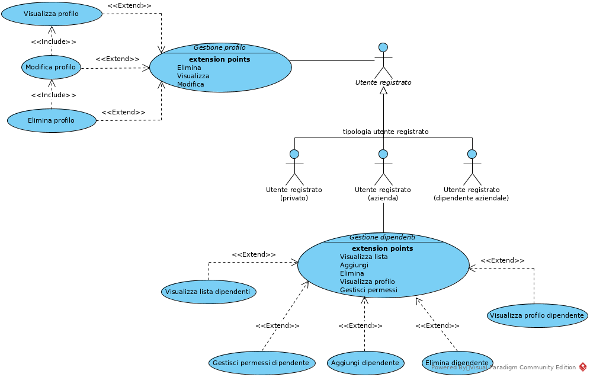

.. _use_case_diagram:

Diagramma dei casi d'uso
~~~~~~~~~~~~~~~~~~~~~~~~

.. tabularcolumns:: |R|p{12cm}|

+-----------------------------------------------------------------------------+
| Ricerca testuale in file multimediali                                       |
+=========================+===================================================+
| **Attore principale**   | Utente non registrato (ospite)                    |
+-------------------------+---------------------------------------------------+
| **Descrizione**         | L'utente può eseguire ricerche testuali nei file  |
|                         | multimediali caricati da un utente registrato     |
|                         | con visibilità pubblica.                          |
+-------------------------+---------------------------------------------------+
| **Precondizioni**       | Deve essere presente almeno un file multimediale  |
|                         | che sia stato caricato con visibilità pubblica.   |
+-------------------------+---------------------------------------------------+
| **Scenario principale** | L'utente sceglie il file di interesse da una      |
|                         | lista di file pubblici ed effettua su quello le   |
|                         | ricerche.                                         |
+-------------------------+---------------------------------------------------+
| **Scenari alternativi** | * Non ci sono file pubblici disponibili           |
|                         | * La parola/frase cercata non è presente nel file |
+-------------------------+---------------------------------------------------+
| **Postcondizioni**      | L'utente ottiene i risultati che mostrano in      |
|                         | quale momento viene pronunciata la parola/frase   |
|                         | cercata nel file multimediale scelto.             |
+-------------------------+---------------------------------------------------+

|

.. tabularcolumns:: |R|p{12cm}|

+-----------------------------------------------------------------------------+
| Ricerca testuale in file multimediali                                       |
+=========================+===================================================+
| **Attore principale**   | Utente registrato (privato)                       |
+-------------------------+---------------------------------------------------+
| **Descrizione**         | L'utente può eseguire ricerche testuali nei file  |
|                         | multimediali che ha caricato e in quelli caricati |
|                         | da altri che ne hanno specificato la visibilità   |
|                         | pubblica.                                         |
+-------------------------+---------------------------------------------------+
| **Precondizioni**       | L'utente deve aver caricato almeno un file o nel  |
|                         | sistema deve essere presente almeno un file con   |
|                         | visibilità pubblica.                              |
+-------------------------+---------------------------------------------------+
| **Scenario principale** | L'utente sceglie il file di interesse da una      |
|                         | lista di file disponibili comprendenti i propri   |
|                         | file e quelli pubblici caricati da altri utenti.  |
+-------------------------+---------------------------------------------------+
| **Scenari alternativi** | * L'utente non ha caricato nessun file e non ci   |
|                         |   sono file pubblici disponibili                  |
|                         | * La parola/frase cercata non è presente nel file |
+-------------------------+---------------------------------------------------+
| **Postcondizioni**      | L'utente ottiene i risultati che mostrano in      |
|                         | quale momento viene pronunciata la parola/frase   |
|                         | cercata nel file multimediale scelto.             |
+-------------------------+---------------------------------------------------+

|

.. tabularcolumns:: |R|p{12cm}|

+-----------------------------------------------------------------------------+
| Ricerca testuale in file multimediali                                       |
+=========================+===================================================+
| **Attore principale**   | Utente registrato (azienda|dipendente aziendale)  |
+-------------------------+---------------------------------------------------+
| **Descrizione**         | L'utente può eseguire ricerche testuali nei file  |
|                         | multimediali che ha caricato e, nel caso disponga |
|                         | dei permessi necessari, anche in quelli caricati  |
|                         | dai propri colleghi.                              |
+-------------------------+---------------------------------------------------+
| **Precondizioni**       | L'utente o, se si dispone dei permessi necessari, |
|                         | uno dei suoi colleghi deve aver caricato almeno   |
|                         | un file nel sistema.                              |
+-------------------------+---------------------------------------------------+
| **Scenario principale** | L'utente sceglie il file di interesse da una      |
|                         | lista di file disponibili comprendenti i propri   |
|                         | ed eventualmente quelli dei propri colleghi.      |
+-------------------------+---------------------------------------------------+
| **Scenari alternativi** | * L'utente non ha caricato nessun file e non ha   |
|                         |   i permessi necessari per vedere quelli dei      |
|                         |   colleghi                                        |
|                         | * Né l'utente né i propri colleghi hanno caricato |
|                         |   alcun file                                      |
|                         | * La parola/frase cercata non è presente nel file |
+-------------------------+---------------------------------------------------+
| **Postcondizioni**      | L'utente ottiene i risultati che mostrano in      |
|                         | quale momento viene pronunciata la parola/frase   |
|                         | cercata nel file multimediale scelto.             |
+-------------------------+---------------------------------------------------+

.. _access_management_use_case:

Gestione degli accessi
----------------------

.. tabularcolumns:: |R|p{12cm}|

+-----------------------------------------------------------------------------+
| Registrazione utente tramite social                                         |
+=========================+===================================================+
| **Attore principale**   | Utente non registrato (ospite)                    |
+-------------------------+---------------------------------------------------+
| **Descrizione**         | L'utente che intenda registrarsi come utente      |
|                         | privato può effettuare la registrazione           |
|                         | automatica tramite social utilizzando il proprio  |
|                         | account Dropbox.                                  |
+-------------------------+---------------------------------------------------+
| **Precondizioni**       | L'utente deve disporre di un account Dropbox      |
|                         | personale da associare al sistema.                |
+-------------------------+---------------------------------------------------+
| **Scenario principale** | * L'utente sceglie la modalità di registrazione   |
|                         |   tramite social e segue la procedura guidata per |
|                         |   associare il proprio account Dropbox con il     |
|                         |   sistema.                                        |
|                         | * Dei dati che non potranno essere ricavati in    |
|                         |   maniera automatica ne verrà richiesto           |
|                         |   l'inserimento manuale al fine di completare la  |
|                         |   registrazione.                                  |
+-------------------------+---------------------------------------------------+
| **Scenari alternativi** | * L'utente non ha un account Dropbox personale    |
|                         | * L'utente non è a conoscenza dei dati di cui si  |
|                         |   richiede l'inserimento manuale                  |
|                         | * L'account Dropbox risulta già registrato        |
+-------------------------+---------------------------------------------------+
| **Postcondizioni**      | L'utente viene registrato nel sistemea e può      |
|                         | accedere alle funzionalità dedicate agli utenti   |
|                         | registrati. L'utente potrà inoltre accedere alle  |
|                         | funzionalità che necessitano dell'associazione di |
|                         | un profilo social.                                |
+-------------------------+---------------------------------------------------+

|

.. tabularcolumns:: |R|p{12cm}|

+-----------------------------------------------------------------------------+
| Registrazione utente classica (privato|azienda)                             |
+=========================+===================================================+
| **Attore principale**   | Utente non registrato (ospite)                    |
+-------------------------+---------------------------------------------------+
| **Descrizione**         | Tramite una ben precisa procedura prevista dal    |
|                         | sistema, l'utente può procedere alla              |
|                         | registrazione presso l'applicazione.              |
+-------------------------+---------------------------------------------------+
| **Precondizioni**       | L'utente deve essere in possesso di tutti i dati  |
|                         | necessari ad una corretta compilazione del modulo |
|                         | di registrazione previsto dal sistema. L'utente   |
|                         | deve inoltre essere in possesso di una casella di |
|                         | posta elettronica valida.                         |
+-------------------------+---------------------------------------------------+
| **Scenario principale** | * Si sceglie il tipo di registrazione da utente   |
|                         |   privato o azienda                               |
|                         | * Si compilano i cambi obbligatori ed             |
|                         |   eventualmente quelli facoltativi                |
|                         | * Viene inviata la richiesta di registrazione     |
+-------------------------+---------------------------------------------------+
| **Scenari alternativi** | * L'identificativo univoco è già stato registrato |
|                         | * I dati inseriti non risultano validi            |
+-------------------------+---------------------------------------------------+
| **Postcondizioni**      | L'utente riceve una mail utile a convalidare la   |
|                         | registrazione.                                    |
+-------------------------+---------------------------------------------------+

|

.. tabularcolumns:: |R|p{12cm}|

+-----------------------------------------------------------------------------+
| Conferma registrazione utente                                               |
+=========================+===================================================+
| **Attore principale**   | Utente non registrato (ospite)                    |
+-------------------------+---------------------------------------------------+
| **Descrizione**         | L'utente riceve una mail che gli permette di      |
|                         | confermare la registrazione, rendendo così attivo |
|                         | il suo account.                                   |
+-------------------------+---------------------------------------------------+
| **Precondizioni**       | L'utente deve aver già effettuato la procedura di |
|                         | registrazione classica. L'utente deve inoltre     |
|                         | essere in grado di accedere alla casella di posta |
|                         | specificata in fase di registrazione.             |
+-------------------------+---------------------------------------------------+
| **Scenario principale** | * Si riceve la mail di conferma della             |
|                         |   registrazione                                   |
|                         | * Si apre il link specificato nella mail          |
|                         | * Si attende la conferma da parte del sistema     |
+-------------------------+---------------------------------------------------+
| **Scenari alternativi** | * L'utente è già stato attivato                   |
+-------------------------+---------------------------------------------------+
| **Postcondizioni**      | L'account utente viene attivato e diventa         |
|                         | possibile effettuare il login con le credenziali  |
|                         | specificate in fase di registrazione.             |
+-------------------------+---------------------------------------------------+

|

.. tabularcolumns:: |R|p{12cm}|

+-----------------------------------------------------------------------------+
| Login utente classica                                                       |
+=========================+===================================================+
| **Attore principale**   | Utente registrato                                 |
+-------------------------+---------------------------------------------------+
| **Descrizione**         | L'utente può effettuare il login nel sistema per  |
|                         | beneficiare delle funzionalità messe a            |
|                         | disposizione per gli utenti registrati.           |
+-------------------------+---------------------------------------------------+
| **Precondizioni**       | L'utente deve aver già effettuato la procedura di |
|                         | registrazione, classica o tramite social.         |
|                         | L'utente deve inoltre aver eseguito con successo  |
|                         | la conferma della registrazione.                  |
+-------------------------+---------------------------------------------------+
| **Scenario principale** | * Si inseriscono le credenziali specificate in    |
|                         |   fase di registrazione                           |
+-------------------------+---------------------------------------------------+
| **Scenari alternativi** | * Le credenziali immesse non risultano corrette   |
+-------------------------+---------------------------------------------------+
| **Postcondizioni**      | L'utente risulta loggato nel sistema              |
+-------------------------+---------------------------------------------------+

|

.. tabularcolumns:: |R|p{12cm}|

+-----------------------------------------------------------------------------+
| Login utente social                                                         |
+=========================+===================================================+
| **Attore principale**   | Utente registrato (privato)                       |
+-------------------------+---------------------------------------------------+
| **Descrizione**         | L'utente può effettuare il login nel sistema per  |
|                         | beneficiare delle funzionalità messe a            |
|                         | disposizione per gli utenti registrati.           |
+-------------------------+---------------------------------------------------+
| **Precondizioni**       | L'utente deve aver già effettuato la procedura di |
|                         | registrazione tramite social.                     |
+-------------------------+---------------------------------------------------+
| **Scenario principale** | * Si effettua il login utilizzando il proprio     |
|                         |   account Dropbox                                 |
+-------------------------+---------------------------------------------------+
| **Scenari alternativi** | * Il login sul social non va a buon fine          |
|                         | * L'utente tenta di fare il login sul social      |
|                         |   dopo aver eseguito la procedura di              |
|                         |   registrazione classica                          |
+-------------------------+---------------------------------------------------+
| **Postcondizioni**      | L'utente risulta loggato nel sistema              |
+-------------------------+---------------------------------------------------+

.. _profile_management_use_case:

Gestione del profilo
--------------------

.. tabularcolumns:: |R|p{12cm}|

+-----------------------------------------------------------------------------+
| Visualizza profilo                                                          |
+=========================+===================================================+
| **Attore principale**   | Utente registrato                                 |
+-------------------------+---------------------------------------------------+
| **Descrizione**         | L'utente può visualizzare le informazioni che lo  |
|                         | riguardano fornite in fase di registrazione.      |
+-------------------------+---------------------------------------------------+
| **Precondizioni**       | L'utente deve aver eseguito correttamente il      |
|                         | login al servizio.                                |
+-------------------------+---------------------------------------------------+
| **Scenario principale** | * L'utente accede al proprio profilo con un       |
|                         |   apposito collegamento                           |
+-------------------------+---------------------------------------------------+
| **Scenari alternativi** | *nessuno scenario alternativo individuato*        |
+-------------------------+---------------------------------------------------+
| **Postcondizioni**      | L'utente visualizza le informazioni del suo       |
|                         | profilo inserite in fase di registrazione         |
+-------------------------+---------------------------------------------------+

|

.. tabularcolumns:: |R|p{12cm}|

+-----------------------------------------------------------------------------+
| Modifica profilo                                                            |
+=========================+===================================================+
| **Attore principale**   | Utente registrato                                 |
+-------------------------+---------------------------------------------------+
| **Descrizione**         | L'utente può modificare le informazioni che lo    |
|                         | riguardano fornite in fase di registrazione.      |
+-------------------------+---------------------------------------------------+
| **Precondizioni**       | L'utente deve aver eseguito correttamente il      |
|                         | login al servizio.                                |
+-------------------------+---------------------------------------------------+
| **Scenario principale** | * L'utente accede al proprio profilo con un       |
|                         |   apposito collegamento                           |
|                         | * Vengono visualizzati i dati del profilo         |
|                         | * L'utente modifica i dati e invia la richiesta   |
|                         |   di modifica al sistema                          |
+-------------------------+---------------------------------------------------+
| **Scenari alternativi** | * L'utente cerca di modificare dei dati con altri |
|                         |   non validi                                      |
+-------------------------+---------------------------------------------------+
| **Postcondizioni**      | Il profilo utente viene modificato correttamente  |
+-------------------------+---------------------------------------------------+

|

.. tabularcolumns:: |R|p{12cm}|

+-----------------------------------------------------------------------------+
| Elimina profilo                                                             |
+=========================+===================================================+
| **Attore principale**   | Utente registrato                                 |
+-------------------------+---------------------------------------------------+
| **Descrizione**         | L'utente può eliminare il proprio account e tutti |
|                         | i dati ad esso collegati. Nel caso il profilo che |
|                         | si voglia eliminare sia un profilo aziendale,     |
|                         | allora con esso verranno cancellati anche i       |
|                         | profili dei dipendenti della stessa azienda.      |
+-------------------------+---------------------------------------------------+
| **Precondizioni**       | L'utente deve aver eseguito correttamente il      |
|                         | login al servizio.                                |
+-------------------------+---------------------------------------------------+
| **Scenario principale** | * L'utente accede al proprio profilo con un       |
|                         |   apposito collegamento                           |
|                         | * L'utente richiede la cancellazione del proprio  |
|                         |   account                                         |
+-------------------------+---------------------------------------------------+
| **Scenari alternativi** | *nessuno scenario alternativo individuato*        |
+-------------------------+---------------------------------------------------+
| **Postcondizioni**      | Il profilo utente viene eliminato e con esso      |
|                         | tutti i dati ad esso associati                    |
+-------------------------+---------------------------------------------------+

|

.. tabularcolumns:: |R|p{12cm}|

+-----------------------------------------------------------------------------+
| Gestione dipendenti / Visualizza lista dipendenti                           |
+=========================+===================================================+
| **Attore principale**   | Utente registrato (azienda)                       |
+-------------------------+---------------------------------------------------+
| **Descrizione**         | L'utente può visualizzare la lista dei dipendenti |
|                         | che sono stati aggiunti.                          |
+-------------------------+---------------------------------------------------+
| **Precondizioni**       | L'utente deve aver eseguito correttamente il      |
|                         | login al servizio.                                |
+-------------------------+---------------------------------------------------+
| **Scenario principale** | * L'utente accede al profilo aziendale con un     |
|                         |   apposito collegamento                           |
+-------------------------+---------------------------------------------------+
| **Scenari alternativi** | * L'utente non ha ancora aggiunto alcun           |
|                         |   dipendente                                      |
+-------------------------+---------------------------------------------------+
| **Postcondizioni**      | L'utente visualizza la lista dei dipendenti       |
+-------------------------+---------------------------------------------------+

|

.. tabularcolumns:: |R|p{12cm}|

+-----------------------------------------------------------------------------+
| Gestione dipendenti / Aggiungi dipendente                                   |
+=========================+===================================================+
| **Attore principale**   | Utente registrato (azienda)                       |
+-------------------------+---------------------------------------------------+
| **Descrizione**         | L'utente può aggiungere un utente come proprio    |
|                         | dipendente.                                       |
+-------------------------+---------------------------------------------------+
| **Precondizioni**       | L'utente deve aver eseguito correttamente il      |
|                         | login al servizio.                                |
+-------------------------+---------------------------------------------------+
| **Scenario principale** | * L'utente accede al profilo aziendale con un     |
|                         |   apposito collegamento                           |
|                         | * L'utente compila il form necessario per         |
|                         |   aggiugere un nuovo dipendente specificando      |
|                         |   una mail valida con cui poter eseguire il login |
+-------------------------+---------------------------------------------------+
| **Scenari alternativi** | * Il dipendente è già stato inserito nella lista  |
|                         |   dei dipendenti                                  |
|                         | * I dati forniti non sono validi                  |
+-------------------------+---------------------------------------------------+
| **Postcondizioni**      | L'utente specificato viene aggiunto alla lista    |
|                         | dei dipendenti aziendali e da quel momento può    |
|                         | effettuare il login con una password casuale      |
|                         | fornita dal sistema tramite mail.                 |
+-------------------------+---------------------------------------------------+

|

.. tabularcolumns:: |R|p{12cm}|

+-----------------------------------------------------------------------------+
| Gestione dipendenti / Elimina dipendente                                    |
+=========================+===================================================+
| **Attore principale**   | Utente registrato (azienda)                       |
+-------------------------+---------------------------------------------------+
| **Descrizione**         | L'utente può rimuovere un utente precedentemente  |
|                         | aggiunto alla lista dei dipendenti aziendali.     |
+-------------------------+---------------------------------------------------+
| **Precondizioni**       | L'utente deve aver eseguito correttamente il      |
|                         | login al servizio.                                |
+-------------------------+---------------------------------------------------+
| **Scenario principale** | * L'utente accede al profilo aziendale con un     |
|                         |   apposito collegamento                           |
|                         | * L'utente sceglie il dipendente da eliminare     |
|                         | * L'utente sceglie se cancellare o ereditare i    |
|                         |   file del dipendente che sta per cancellare      |
|                         | * Viene inviata la richiesta di cancellazione     |
+-------------------------+---------------------------------------------------+
| **Scenari alternativi** | * Il dipendente è già stato rimosso dalla lista   |
|                         |   dei dipendenti                                  |
+-------------------------+---------------------------------------------------+
| **Postcondizioni**      | L'utente specificato viene eliminato dalla lista  |
|                         | dei dipendenti aziendali e da quel momento non    |
|                         | può più effettuare il login al sistema o accedere |
|                         | ai file da lui caricati.                          |
+-------------------------+---------------------------------------------------+

|

.. tabularcolumns:: |R|p{12cm}|

+-----------------------------------------------------------------------------+
| Gestione dipendenti / Visualizza profilo dipendente                         |
+=========================+===================================================+
| **Attore principale**   | Utente registrato (azienda)                       |
+-------------------------+---------------------------------------------------+
| **Descrizione**         | L'utente può visualizzare le informazioni di      |
|                         | profilo del dipendente e i file da lui caricati.  |
+-------------------------+---------------------------------------------------+
| **Precondizioni**       | L'utente deve aver eseguito correttamente il      |
|                         | login al servizio.                                |
+-------------------------+---------------------------------------------------+
| **Scenario principale** | * L'utente accede al profilo aziendale con un     |
|                         |   apposito collegamento                           |
|                         | * L'utente sceglie il dipendente da visualizzare  |
|                         |   dalla lista dei dipendenti aziendali            |
+-------------------------+---------------------------------------------------+
| **Scenari alternativi** | *nessuno scenario alternativo individuato*        |
+-------------------------+---------------------------------------------------+
| **Postcondizioni**      | L'utente visualizza le informazioni di profilo e  |
|                         | i file caricati dal dipendente scelto.            |
+-------------------------+---------------------------------------------------+

|

.. tabularcolumns:: |R|p{12cm}|

+-----------------------------------------------------------------------------+
| Gestione dipendenti / Gestisci permessi dipendente                          |
+=========================+===================================================+
| **Attore principale**   | Utente registrato (azienda)                       |
+-------------------------+---------------------------------------------------+
| **Descrizione**         | L'utente può visualizzare modificare i permessi   |
|                         | che un dipendente ha rispetto alla                |
|                         | visualizzazione e all'uso dei file caricati dagli |
|                         | altri dipendenti della stessa azienda.            |
+-------------------------+---------------------------------------------------+
| **Precondizioni**       | L'utente deve aver eseguito correttamente il      |
|                         | login al servizio.                                |
+-------------------------+---------------------------------------------------+
| **Scenario principale** | * L'utente accede al profilo aziendale con un     |
|                         |   apposito collegamento                           |
|                         | * L'utente sceglie il dipendente di cui cambiare  |
|                         |   i permessi                                      |
|                         | * L'utente modifica i permessi secondo necessità  |
|                         |   e invia la richiesta di modifica al sistema     |
+-------------------------+---------------------------------------------------+
| **Scenari alternativi** | *nessuno scenario alternativo individuato*        |
+-------------------------+---------------------------------------------------+
| **Postcondizioni**      | I permessi associati all'account del dipendente   |
|                         | vengono modificati come richiesto e l'utente e la |
|                         | lista dei file che può vedere e utilizzare verrà  |
|                         | cambiata di conseguenza.                          |
+-------------------------+---------------------------------------------------+

.. _payments_management_use_case:

Gestione dei pagamenti
----------------------

.. tabularcolumns:: |R|p{12cm}|

+-----------------------------------------------------------------------------+
| Visualizza piani di pagamento                                               |
+=========================+===================================================+
| **Attore principale**   | Utente registrato (azienda)                       |
+-------------------------+---------------------------------------------------+
| **Descrizione**         | L'utente può visualizzare i possibili piani di    |
|                         | pagamento al fine di stipulare un abbonamento che |
|                         | si adatti alle esigenze dell'azienda.             |
+-------------------------+---------------------------------------------------+
| **Precondizioni**       | L'utente deve aver eseguito correttamente il      |
|                         | login al servizio.                                |
+-------------------------+---------------------------------------------------+
| **Scenario principale** | * L'utente accede alla pagina dedicata ai piani   |
|                         |   di pagamento                                    |
+-------------------------+---------------------------------------------------+
| **Scenari alternativi** | *nessuno scenario alternativo individuato*        |
+-------------------------+---------------------------------------------------+
| **Postcondizioni**      | L'utente può visualizzare i piani di pagamento    |
|                         | messi a disposizione per l'eventuale acquisto da  |
|                         | parte dell'azeinda.                               |
+-------------------------+---------------------------------------------------+

|

.. tabularcolumns:: |R|p{12cm}|

+-----------------------------------------------------------------------------+
| Acquista abbonamento                                                        |
+=========================+===================================================+
| **Attore principale**   | Utente registrato (azienda)                       |
+-------------------------+---------------------------------------------------+
| **Descrizione**         | L'utente può acquistare un abbonamento sulla base |
|                         | del piano di pagamento scelto.                    |
+-------------------------+---------------------------------------------------+
| **Precondizioni**       | L'utente deve aver eseguito correttamente il      |
|                         | login al servizio.                                |
+-------------------------+---------------------------------------------------+
| **Scenario principale** | * L'utente accede alla pagina dedicata ai piani   |
|                         |   di pagamento                                    |
|                         | * Si sceglie il piano di pagamento che meglio     |
|                         |   rispecchia le necessità dell'azienda            |
|                         | * Si effettua il pagamento                        |
+-------------------------+---------------------------------------------------+
| **Scenari alternativi** | *Si veda il caso d'uso "Effettua pagamento"*      |
+-------------------------+---------------------------------------------------+
| **Postcondizioni**      | L'utente riceve i crediti necessari ad utilizzare |
|                         | il servizio nella quantità e nel costo stabiliti  |
|                         | dal piano di pagamento scelto. I crediti ricevuti |
|                         | sono utilizzabili da tutti i dipendenti           |
|                         | dell'azienda entro la scadenza dell'abbonamento   |
|                         | altrimenti sono da considerarsi persi e non       |
|                         | rimborsabili.                                     |
+-------------------------+---------------------------------------------------+

|

.. tabularcolumns:: |R|p{12cm}|

+-----------------------------------------------------------------------------+
| Acquista estensione abbonamento                                             |
+=========================+===================================================+
| **Attore principale**   | Utente registrato (azienda)                       |
+-------------------------+---------------------------------------------------+
| **Descrizione**         | L'utente può acquistare un'estensione             |
|                         | dell'abbonamento per ottenere ulteriori crediti.  |
+-------------------------+---------------------------------------------------+
| **Precondizioni**       | L'utente deve aver eseguito correttamente il      |
|                         | login al servizio e deve avere un abbonamento     |
|                         | attivo e non scaduto.                             |
+-------------------------+---------------------------------------------------+
| **Scenario principale** | * L'utente accede alla pagina dedicata ai piani   |
|                         |   di pagamento                                    |
|                         | * Sceglie il numero di crediti necessari in       |
|                         |   termini di ore di elaborazione                  |
|                         | * Si effettua il pagamento                        |
+-------------------------+---------------------------------------------------+
| **Scenari alternativi** | *Si veda il caso d'uso "Effettua pagamento"*      |
+-------------------------+---------------------------------------------------+
| **Postcondizioni**      | L'utente riceve il numero di crediti richiesti a  |
|                         | un prezzo dipendente dal numero stesso scelto     |
|                         | dal sistema. I crediti acquistati sono subito     |
|                         | utilizzabili e disponibili a tutti i dipendenti   |
|                         | dell'azienda entro la scadenza dell'abbonamento   |
|                         | che si sta estendendo. I crediti non utilizzati   |
|                         | alla data di scadenza sono da considerarsi persi  |
|                         | e non rimborsabili.                               |
+-------------------------+---------------------------------------------------+

|

.. tabularcolumns:: |R|p{12cm}|

+-----------------------------------------------------------------------------+
| Effettua pagamento                                                          |
+=========================+===================================================+
| **Attore principale**   | Utente registrato (azienda)                       |
+-------------------------+---------------------------------------------------+
| **Descrizione**         | L'utente può effettuare il pagamento del servizio |
|                         | tramite conto `Paypal`_.                          |
+-------------------------+---------------------------------------------------+
| **Precondizioni**       | L'utente deve aver eseguito correttamente il      |
|                         | login al servizio e deve avere scelto un prodotto |
|                         | da acquistare (abbonamento o estensione)          |
+-------------------------+---------------------------------------------------+
| **Scenario principale** | * L'utente accede alla pagina dedicata ai piani   |
|                         |   di pagamento                                    |
|                         | * Sceglie il prodotto da acquistare               |
|                         | * Effettua il pagamento tramite il portale Paypal |
+-------------------------+---------------------------------------------------+
| **Scenari alternativi** | * Il pagamento non va a buon fine                 |
|                         | * Il pagamento viene annullato                    |
+-------------------------+---------------------------------------------------+
| **Postcondizioni**      | L'utente riceve il prodotto acquistato insieme    |
|                         | con un riepilogo dei costi sostenuti.             |
|                         | Il valore del prodotto acquistato viene scalato   |
|                         | dal conto Paypal dell'utente e accreditato su     |
|                         | un apposito conto di riferimento per il servizio. |
+-------------------------+---------------------------------------------------+

|

.. tabularcolumns:: |R|p{12cm}|

+-----------------------------------------------------------------------------+
| Visualizza stato abbonamento + Visualizza crediti rimanenti                 |
+=========================+===================================================+
| **Attore principale**   | Utente registrato (azienda)                       |
+-------------------------+---------------------------------------------------+
| **Descrizione**         | L'utente può visualizzare i dati dell'abbonamento |
|                         | acquistato per conoscerne la scadenza, il numero  |
|                         | di crediti utilizzati e quelli rimanenti, più     |
|                         | altre informazioni utili.                         |
+-------------------------+---------------------------------------------------+
| **Precondizioni**       | L'utente deve aver eseguito correttamente il      |
|                         | login al servizio e deve avere stipulato almeno   |
|                         | un abbonamento, anche se scaduto.                 |
+-------------------------+---------------------------------------------------+
| **Scenario principale** | * L'utente accede alla pagina dedicata allo stato |
|                         |   dell'abbonamento e visualizza le informazioni   |
|                         |   di interesse.                                   |
+-------------------------+---------------------------------------------------+
| **Scenari alternativi** | *nessuno scenario alternativo individuato*        |
+-------------------------+---------------------------------------------------+
| **Postcondizioni**      | L'utente può visualizzare le informazioni di      |
|                         | interesse che riguardano lo stato                 |
|                         | dell'abbonamento attualmente attivo o di quelli   |
|                         | precedenti già scaduti.                           |
+-------------------------+---------------------------------------------------+

.. _contents_upload_management_use_case:

Gestione upload contenuti
-------------------------

.. tabularcolumns:: |R|p{12cm}|

+-----------------------------------------------------------------------------+
| Upload contenuti multimediali                                               |
+=========================+===================================================+
| **Attore principale**   | Utente registrato                                 |
+-------------------------+---------------------------------------------------+
| **Descrizione**         | L'utente può fare l'upload di contenuti           |
|                         | multimediali audio/video che vuole elaborare.     |
|                         | L'upload richiede eventualmente controlli e       |
|                         | conversioni di formato.                           |
+-------------------------+---------------------------------------------------+
| **Precondizioni**       | L'utente deve aver eseguito correttamente il      |
|                         | login al servizio e deve disporre dei crediti     |
|                         | necessari per elaborare il file di cui si intende |
|                         | fare l'upload. Se si tratta di un utente privato  |
|                         | l'acquisto dei crediti viene svolto               |
|                         | contestualmente all'upload del file.              |
+-------------------------+---------------------------------------------------+
| **Scenario principale** | * L'utente accede alla pagine di upload dei       |
|                         |   contenuti e seleziona un file dal proprio       |
|                         |   dispositivo                                     |
|                         | * Se si tratta di un utente privato che avesse    |
|                         |   svolto la registrazione tramite social, allora  |
|                         |   il file può essere scelto tra quelli presenti   |
|                         |   sul proprio account Dropbox associato           |
|                         | * Il file viene sottoposto a controlli per        |
|                         |   l'accettazione del formato e della codifica in  |
|                         |   cui è presentato                                |
|                         | * Il file viene eventualmente convertito in un    |
|                         |   formato e con una codifica consoni              |
|                         | * L'utente specifica alcune informazioni utili    |
|                         |   che permettano di riconoscere e qualificare il  |
|                         |   file inviato tra gli altri file.                |
|                         | * Il file viene inviato al sistema per            |
|                         |   l'elaborazione                                  |
+-------------------------+---------------------------------------------------+
| **Scenari alternativi** | * Il file scelto non è in nessuno dei formati e   |
|                         |   delle codifiche accettate dal sistema           |
|                         | * Non c'è nessun file sull'account Dropbox (se    |
|                         |   utente privato registrato tramite social)       |
|                         | * Il file risulta corrotto e non leggibile        |
|                         | * La conversione del file non va a buon fine      |
|                         | * Il file viene cancellato dal dispositivo di     |
|                         |   origine prima della fine delle operazioni di    |
|                         |   verifica, conversione e upload                  |
|                         | * L'upload del file non va a buon fine            |
|                         | * Le informazioni inserite per la descrizione del |
|                         |   file risultano incomplete o non valide          |
+-------------------------+---------------------------------------------------+
| **Postcondizioni**      | Il file utente viene caricato sul sistema che lo  |
|                         | prepara per l'elaborazione.                       |
+-------------------------+---------------------------------------------------+

.. _requests_management_use_case:

Gestione richieste
------------------

.. tabularcolumns:: |R|p{12cm}|

+-----------------------------------------------------------------------------+
| Visualizza lista richieste inviate                                          |
+=========================+===================================================+
| **Attore principale**   | Utente registrato                                 |
+-------------------------+---------------------------------------------------+
| **Descrizione**         | L'utente può visualizzare la lista dei file che   |
|                         | ha caricato. Nel caso si tratti di un utente      |
|                         | dipendente aziendale con i permessi necessari,    |
|                         | allora sarà in gradi di visualizzare anche i file |
|                         | caricati dai propri colleghi.                     |
+-------------------------+---------------------------------------------------+
| **Precondizioni**       | L'utente deve aver eseguito correttamente il      |
|                         | login al servizio e deve avere caricato sul       |
|                         | sistema almeno un file. Nel caso si tratti di un  |
|                         | utente dipendente aziendale con i permessi        |
|                         | necessari, potrà accedere a questa funzionalità   |
|                         | anche senza aver caricato alcun file, ma          |
|                         | visualizzando i file caricati dai propri          |
|                         | colleghi.                                         |
+-------------------------+---------------------------------------------------+
| **Scenario principale** | * L'utente accede alla pagina dedicata alla       |
|                         |   visualizzazione della lista delle richieste     |
|                         |   inviate                                         |
+-------------------------+---------------------------------------------------+
| **Scenari alternativi** | *nessuno scenario alternativo individuato*        |
+-------------------------+---------------------------------------------------+
| **Postcondizioni**      | L'utente può visualizzare la lista dei file       |
|                         | caricati a cui ha accesso e alcune informazioni   |
|                         | basilari come lo stato di avanzamento nel caso di |
|                         | richieste ancora in fase di elaborazione.         |
+-------------------------+---------------------------------------------------+

|

.. tabularcolumns:: |R|p{12cm}|

+-----------------------------------------------------------------------------+
| Visualizza informazioni sui file inviati                                    |
+=========================+===================================================+
| **Attore principale**   | Utente registrato                                 |
+-------------------------+---------------------------------------------------+
| **Descrizione**         | L'utente può scegliere un file tra quelli         |
|                         | caricati e vederne tutte le informazioni          |
|                         | dettagliate.                                      |
+-------------------------+---------------------------------------------------+
| **Precondizioni**       | L'utente deve aver eseguito correttamente il      |
|                         | login al servizio e deve avere caricato sul       |
|                         | sistema almeno un file. Nel caso si tratti di un  |
|                         | utente dipendente aziendale con i permessi        |
|                         | necessari, potrà accedere a questa funzionalità   |
|                         | anche senza aver caricato alcun file, ma          |
|                         | utilizzando i file caricati dai propri colleghi.  |
+-------------------------+---------------------------------------------------+
| **Scenario principale** | * L'utente accede alla pagina dedicata alla       |
|                         |   visualizzazione della lista delle richieste     |
|                         |   inviate                                         |
|                         | * L'utente sceglie il file del quale vuole avere  |
|                         |   più informazioni                                |
+-------------------------+---------------------------------------------------+
| **Scenari alternativi** | *nessuno scenario alternativo individuato*        |
+-------------------------+---------------------------------------------------+
| **Postcondizioni**      | L'utente visualizza tutte le informazioni sul     |
|                         | file caricato scelto.                             |
+-------------------------+---------------------------------------------------+

|

.. tabularcolumns:: |R|p{12cm}|

+-----------------------------------------------------------------------------+
| Modifica informazioni sui file inviati                                      |
+=========================+===================================================+
| **Attore principale**   | Utente registrato                                 |
+-------------------------+---------------------------------------------------+
| **Descrizione**         | L'utente può scegliere un file tra quelli         |
|                         | caricati e modificarne alcune informazioni.       |
+-------------------------+---------------------------------------------------+
| **Precondizioni**       | L'utente deve aver eseguito correttamente il      |
|                         | login al servizio e deve avere caricato sul       |
|                         | sistema almeno un file. Nel caso si tratti di un  |
|                         | utente dipendente aziendale con i permessi        |
|                         | necessari, potrà accedere a questa funzionalità   |
|                         | anche senza aver caricato alcun file, ma          |
|                         | utilizzando i file caricati dai propri colleghi.  |
+-------------------------+---------------------------------------------------+
| **Scenario principale** | * L'utente accede alla pagina dedicata alla       |
|                         |   visualizzazione della lista delle richieste     |
|                         |   inviate                                         |
|                         | * L'utente sceglie il file del quale vuole avere  |
|                         |   più informazioni                                |
|                         | * L'utente sceglie le informazioni da modificare  |
|                         | * Viene inviata la richiesta di modifica          |
+-------------------------+---------------------------------------------------+
| **Scenari alternativi** | * Le nuove informazioni immesse non sono valide   |
|                         | * Le informazioni sul file risultano incomplete   |
+-------------------------+---------------------------------------------------+
| **Postcondizioni**      | Le informazioni sul file vengono modificate       |
|                         | correttamente.                                    |
+-------------------------+---------------------------------------------------+

|

.. tabularcolumns:: |R|p{12cm}|

+-----------------------------------------------------------------------------+
| Rimuovi richiesta                                                           |
+=========================+===================================================+
| **Attore principale**   | Utente registrato                                 |
+-------------------------+---------------------------------------------------+
| **Descrizione**         | L'utente può scegliere un file tra quelli         |
|                         | caricati ed eliminarlo.                           |
+-------------------------+---------------------------------------------------+
| **Precondizioni**       | L'utente deve aver eseguito correttamente il      |
|                         | login al servizio e deve avere caricato sul       |
|                         | sistema almeno un file. Nel caso si tratti di un  |
|                         | utente dipendente aziendale con i permessi        |
|                         | necessari, potrà accedere a questa funzionalità   |
|                         | anche senza aver caricato alcun file, ma          |
|                         | utilizzando i file caricati dai propri colleghi.  |
+-------------------------+---------------------------------------------------+
| **Scenario principale** | * L'utente accede alla pagina dedicata alla       |
|                         |   visualizzazione della lista delle richieste     |
|                         |   inviate                                         |
|                         | * L'utente sceglie il file che vuole eliminare    |
|                         | * Viene inviata la richiesta di rimozione         |
+-------------------------+---------------------------------------------------+
| **Scenari alternativi** | * Il file è già stato rimosso                     |
+-------------------------+---------------------------------------------------+
| **Postcondizioni**      | Il file e tutte le informazioni ad esso collegate |
|                         | vengono rimosse.                                  |
+-------------------------+---------------------------------------------------+

.. _Paypal: https://www.paypal.com

